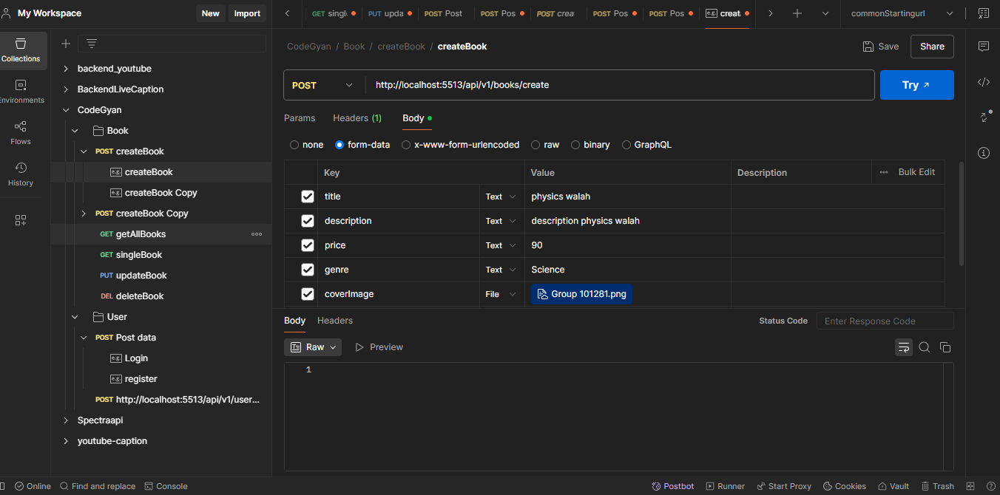

# CodersGyan eBook API

A robust RESTful API for an eBook platform, built with Node.js, Express, TypeScript, and MongoDB. This project allows users to register, log in, and manage eBooks (CRUD operations), including file uploads to Cloudinary.



## Table of Contents

- [Features](#features)
- [Tech Stack](#tech-stack)
- [Project Structure](#project-structure)
- [Getting Started](#getting-started)
- [Environment Variables](#environment-variables)
- [API Endpoints](#api-endpoints)
  - [User Routes](#user-routes)
  - [Book Routes](#book-routes)
- [Authentication](#authentication)
- [Error Handling](#error-handling)
- [File Uploads](#file-uploads)
- [License](#license)
- [Author](#author)

---

## Features

- User registration and login with JWT authentication
- Secure password hashing with bcrypt
- CRUD operations for eBooks
- File uploads (cover images and PDFs) to Cloudinary
- MongoDB for data persistence
- Global error handling
- Modular and scalable code structure

---

## Tech Stack

- **Backend:** Node.js, Express.js, TypeScript
- **Database:** MongoDB (via Mongoose)
- **Authentication:** JWT
- **File Uploads:** Multer, Cloudinary
- **Other:** dotenv, ESLint, Prettier

---

## Project Structure

```
.
├── src/
│   ├── app.ts                # Main Express app setup
│   ├── config/               # Configuration (DB, Cloudinary, etc.)
│   ├── middlewares/          # Custom middleware (auth, error handler)
│   ├── book/                 # Book model, controller, routes, types
│   ├── user/                 # User model, controller, routes, types
│   └── public/               # Static files and uploads
├── server.ts                 # Server entry point
├── package.json
├── tsconfig.json
├── .env                      # Environment variables (not committed)
└── .gitignore
```

---

## Getting Started

### Prerequisites

- Node.js (v16+ recommended)
- MongoDB instance (local or cloud)
- Cloudinary account (for file uploads)

### Installation

1. **Clone the repository:**
   ```bash
   git clone <repo-url>
   cd CodersGyan
   ```

2. **Install dependencies:**
   ```bash
   npm install
   ```

3. **Set up environment variables:**
   - Copy `.env.example` to `.env` and fill in your values (see [Environment Variables](#environment-variables)).

4. **Run the development server:**
   ```bash
   npm run dev
   ```

   The server will start on the port specified in your `.env` file (default: 3000).

---

## Environment Variables

Create a `.env` file in the root directory with the following variables:

```
PORT=3000
MONGO_CONNECTION_STRING=your_mongodb_uri
JWT_SECRETE=your_jwt_secret
CLOUDINARY_CLOUD_NAME=your_cloudinary_cloud_name
CLOUDINARY_API_KEY=your_cloudinary_api_key
CLOUDINARY_API_SECRET=your_cloudinary_api_secret
```

---

## API Endpoints

### User Routes

| Method | Endpoint            | Description           | Auth Required |
|--------|---------------------|----------------------|--------------|
| POST   | `/api/v1/users/register` | Register a new user   | No           |
| POST   | `/api/v1/users/login`    | Login and get JWT     | No           |

#### Register

```json
POST /api/v1/users/register
{
  "username": "string",
  "email": "string",
  "password": "string"
}
```

#### Login

```json
POST /api/v1/users/login
{
  "email": "string",
  "password": "string"
}
```

---

### Book Routes

| Method | Endpoint                  | Description                | Auth Required |
|--------|---------------------------|----------------------------|--------------|
| POST   | `/api/v1/books/create`    | Create a new book          | Yes          |
| GET    | `/api/v1/books/getallbooks` | Get all books              | No           |
| GET    | `/api/v1/books/:id`       | Get book by ID             | No           |
| PUT    | `/api/v1/books/:id`       | Update a book              | Yes (owner)  |
| DELETE | `/api/v1/books/:id`       | Delete a book              | Yes (owner)  |

#### Create Book

- **Form Data:** `coverImage` (image), `file` (PDF), `title`, `description`, `price`, `genre`
- **Headers:** `Authorization: Bearer <token>`

#### Update Book

- **Form Data:** Any of the book fields, optionally new `coverImage` or `file`
- **Headers:** `Authorization: Bearer <token>`

---

## Authentication

- Uses JWT for protected routes.
- Pass the token in the `Authorization` header as `Bearer <token>`.

---

## Error Handling

- All errors are handled by a global error handler.
- Returns JSON with `message` and appropriate HTTP status code.

---

## File Uploads

- Uses Multer for handling multipart/form-data.
- Uploaded files (cover images and PDFs) are stored temporarily and then uploaded to Cloudinary.
- URLs to the files are saved in the database.

---

## License

ISC

---

## Author

- **Ikhlas Gadagin**  
  [gadaginikhlas003@gmail.com](mailto:gadaginikhlas003@gmail.com)

---


